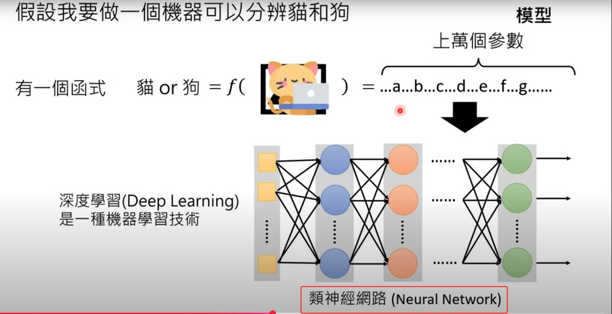

# Artificial Intelligence

> content below are transcribed my gemini.

- Defining AI: The video explains that AI refers to intelligence created by humans and exhibited by machines [00:18]. It highlights that there isn't a single, universally accepted definition of intelligence, leading to varied perceptions of what constitutes AI [01:26].

- What is Generative AI?: Generative AI is defined as the ability of machines to produce complex and structured objects, such as articles, images, or audio [02:05]. The complexity implies that the generated output cannot be exhaustively enumerated, as demonstrated by the vast number of possibilities for a 100-word Chinese article [02:50].

- Generative AI vs. Classification: The speaker differentiates Generative AI from classification problems, where machines choose from a limited set of options, such as classifying an email as spam or identifying a cat or dog in an image [04:50].
  - ML terms
    - inference:  testing
    - training: the process of using training data to find the unknown parameters in the function
    - neural network: how to express the function with more than 10k of parameters. It is not about simulating how human brain learns
  
  

- Machine Learning and Deep Learning: The video introduces machine learning as a method for machines to automatically find a function (parameters) from data [06:53]. It then explains deep learning as a subfield of machine learning that uses neural networks (models with a large number of parameters) to represent these functions [12:47].

- Relationship between Generative AI, Machine Learning, and Deep Learning: While Generative AI is a goal and deep learning is a technique, the video notes that current Generative AI challenges are often tackled using deep learning due to their complexity [14:50].

- How Generative AI Works (e.g., ChatGPT and Image Generation): Using ChatGPT as an example, the video illustrates how large language models work by breaking down complex generation tasks into a series of "word-guessing" or "next-word prediction" problems [21:32]. This transforms an infinite possibility problem into a series of finite classification problems [23:28]. The same concept can be applied to image generation by predicting pixels [25:06].

Challenges and the Future of Generative AI: The video touches upon the challenge of Generative AI producing novel outputs that were not explicitly in its training data, suggesting a form of "creativity" [20:23]. It also highlights that Generative AI is not a new concept, citing Google Translate as an early application [27:42], and sets the stage for future discussions on why Generative AI has recently exploded in popularity [28:32].