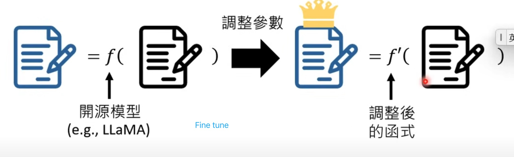

# 2: What Makes Today's Generative Artificial Intelligence So Powerful?

> From Specialist → Generalist  
> From A Tool → A Digital Generalist

## Evaluating LLMs from Multiple Perspectives

- Since LLMs focus on content generation (structural learning) rather than classification tasks (where we don't control the output options), we must carefully assess potential harmful or biased outputs in the generated content.
- We expect LLMs to be generalists, so solely stressing single-aspect capability when evaluating LLMs is not a good evaluation measure.

## Prompt Engineering: Learning to Be a Better Commander

- **Engineering**: Skillful design and optimization
- **Prompt**: The art of communicating effectively with LLMs

## Fine-tuning Models: Precision Modification of Neural Networks

Fine-tuning is analogous to performing precise surgery on a neural network's learned representations.

