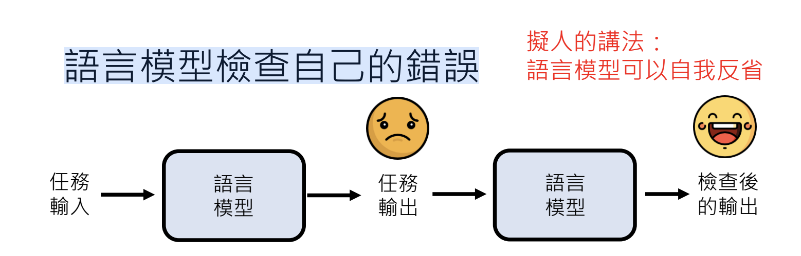
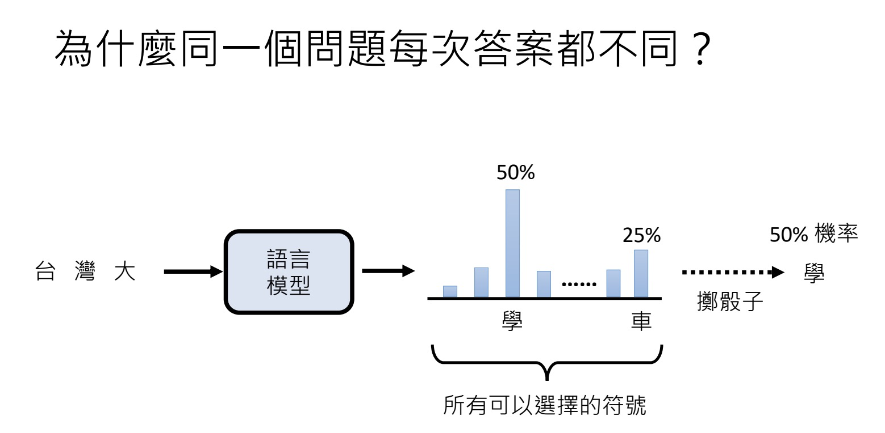
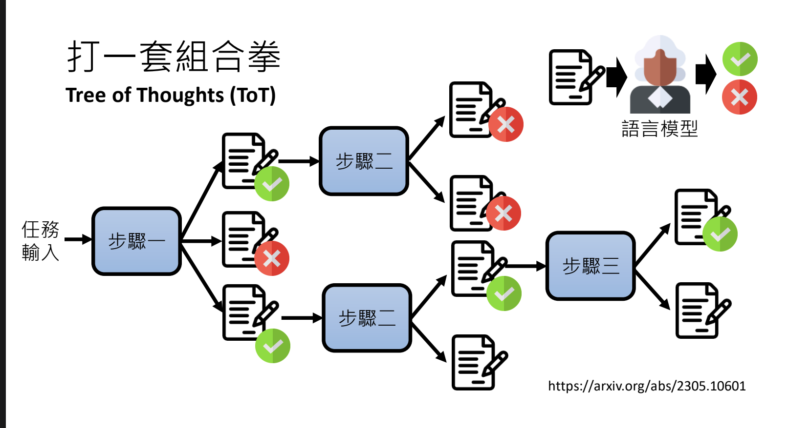
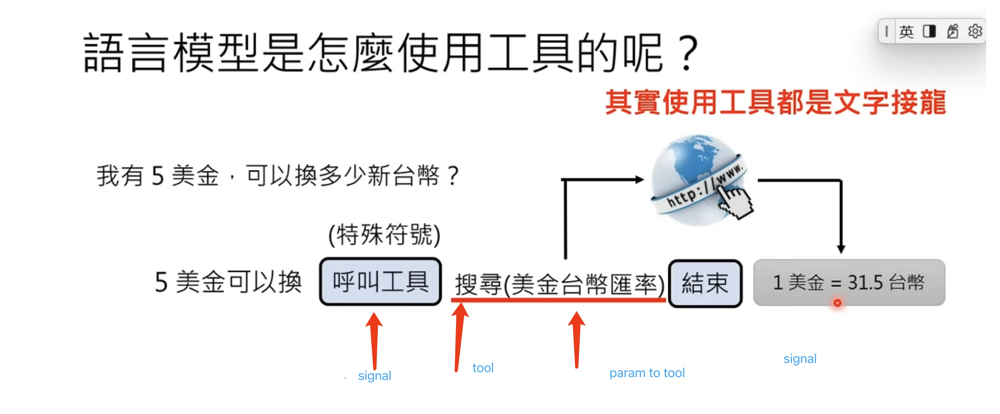

# 04. Train Yourself part II

## Materials

- Recording: [Troubleshooting and using tools](https://www.youtube.com/watch?v=lwe3_x50_uw&list=PLJV_el3uVTsPz6CTopeRp2L2t4aL_KgiI&index=5)
- slides, see [here on Google Slides]([Lecture](http://drive.google.com/file/d/1eVC4dx77Mba2_yMFe1_w4tXvIdSDTOCO/view))

## Improve Task and problem-solving capabilities

- Break a bigger Task into smaller tasks
  -
  - Why does `Chain of thought` work? It pushes models to break a bigger Task into smaller tasks
- Direct LLMs to check errors in their output
  -
  - LLMs can recognize their errors (GPT 4)
  - But, > during the introspection process, no model is trained; so the function is fixed.
Its capabilities are not changed.

- Why the same input may get a different output from LLMs
  - The same input gets a probability (item) range.
  - Then LLMs roll the dice to select an item from the range for you
  - That means, even if the same input can bring you the same probability range, the result is random
    
  - Enforce its capability by doing it multiple times, then get the most frequent result. This method is self consistency.

### Tree of Thoughts

Combine the process to solve the problem.

Decomposition.

### Strength LLM capability using Tools

- Search Engine
  - 
  - How GPT-4 decides when to use search
- Program of Thought
  - Before the time LLMs were able to use tools, they solved problems using next word prediction
  - Now, LLMs use tools to solve math problems

- How LLMs know when to use what tools
  - recognize the information needs realtime data -> call tool signal
  - use tool
  - reaches the end the conversation signal
  - learn more at [break tasks and use tools](https://www.youtube.com/watch?app=desktop&feature=shared&v=ZID220t_MpI)

