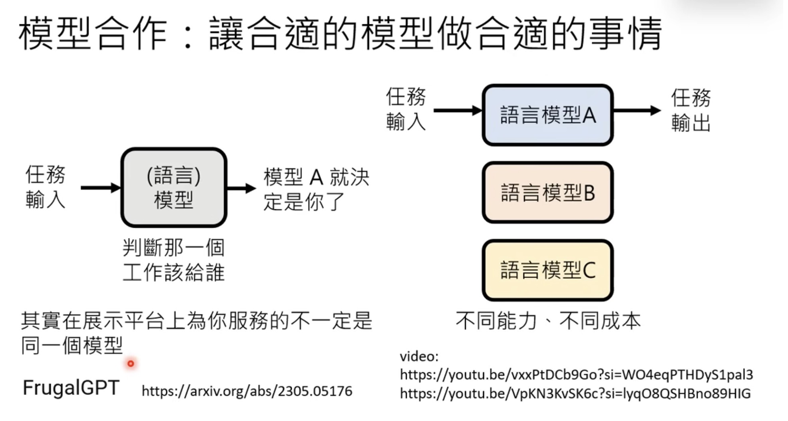
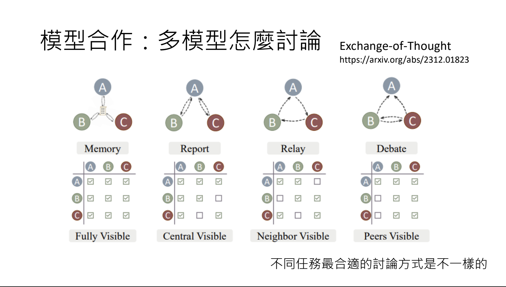
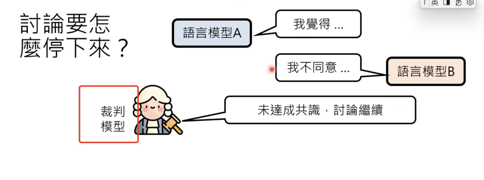
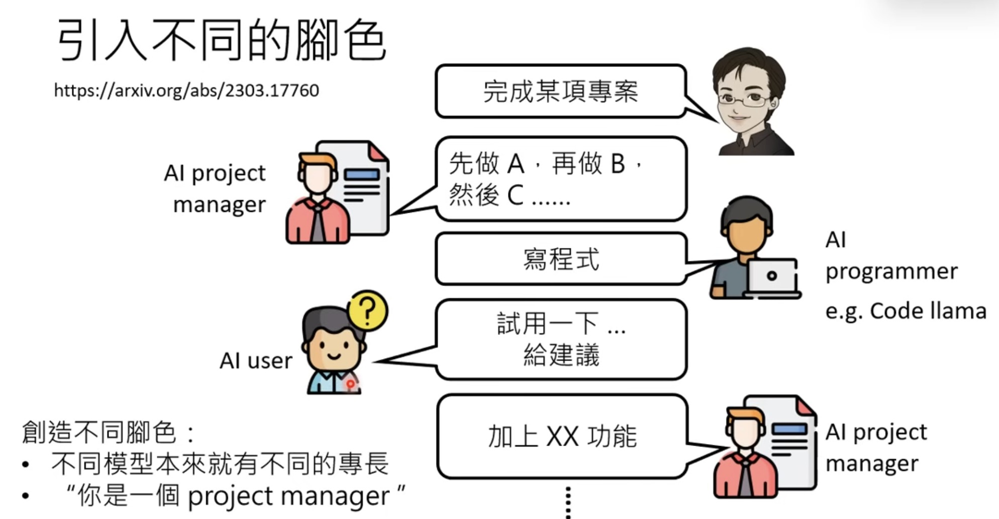

# Organizing Teams Using Different LLMs

**Recording:**
[生成式AI導論 2024】第5講：訓練不了人工智慧？你可以訓練你自己 (下) — 讓語言彼此合作，把一個人活成一個團隊 (開頭有芙莉蓮雷，慎入)](https://www.youtube.com/watch?v=inebiWdQW-4&list=PLJV_el3uVTsPz6CTopeRp2L2t4aL_KgiI&index=6)

**My Learnings:**
- **Metacognitive limitations**: LLMs struggle with accurate self-reflection and error detection, similar to human cognitive blind spots and biases
- **Collaborative intelligence**: Multi-LLM systems can outperform individual models through role specialization (judge, coordinator, specialist), leveraging collective reasoning
- **Task-specific efficiency**: Different LLMs show varying cost-effectiveness ratios for identical tasks, following economic principles of comparative advantage and task granularity optimization

LLMs benefit from human-inspired collaborative strategies while following economic optimization principles.

## Key Points

- LLM reflection may have inherent flaws: see [Encouraging Divergent Thinking in Large Language Models through Multi-Agent Debate](https://arxiv.org/abs/2305.19118), which identifies the DoT problem. The study shows that reflection-style methods suffer from the Degeneration-of-Thought (DoT) problem: once an LLM establishes confidence in its solutions, it cannot generate novel thoughts later through reflection even if its initial stance is incorrect. To address the DoT problem, they propose a Multi-Agent Debate (MAD) framework, where multiple agents express their arguments in a "tit for tat" state and a judge manages the debate process to obtain a final solution.
- Different models may have different capabilities and costs for different tasks.

    
- How to facilitate discussion between LLMs:
    
    
- 
- 
- 

## Interesting Findings

- [MetaGPT Framework](https://github.com/FoundationAgents/MetaGPT)
- 