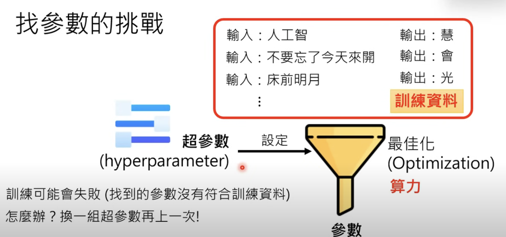
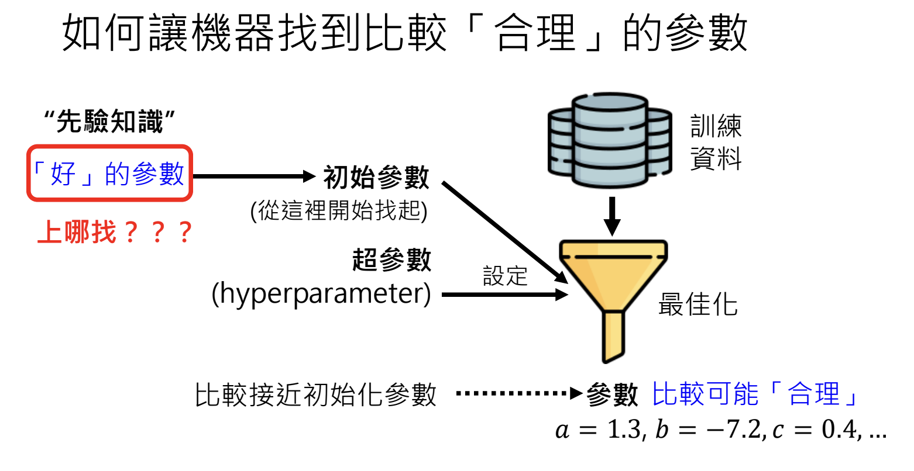

# Train LLM P1

Course Materials

- recording: [大型語言模型修練史 — 第一階段: 自我學習，累積實力](https://www.youtube.com/watch?v=cCpErV7To2o&t=476s)
- slides: [大型語言模型修練史 — 第一階段: 自我學習，累積實力](https://drive.google.com/file/d/1myvHjoeFOpIl1uGU9H1t4OpDErkhF0zO/view)

## Notes

- The LLM training process

- The challenges in training LLMs
  - Figuring the params: design a hyper parameter -> optimized parameters
  
  - overfitting
    - why this could happen: Machine learning only finds parameters that "fit" the training data, regardless of whether it makes sense or not.
    - solutions
      - Provide diverse training data
      - design the initial parameters
      
- What Knowledge Machine needs to know first
  - Understand natural language grammars, [100 M token is enough](https://arxiv.org/abs/2011.04946)
  - Understand the world, [providing 30 billion data still doesn't work very well](https://arxiv.org/abs/2011.04946) as the understanding of world has different levels.
    - train model with high quality materials repeatedly multiple times
    - copyright concerns
- The problem in the CPT 3.0 area - LLMs appear to have learned knowledge but lack the ability to effectively utilize it.

## Terms

- overfitting: The model works in training data but doesn't work in test data.
- self supervised learning: machine learns from data without human involves in.

## Questions

- [ ] Get clear understanding to `hyperparameter` in ML 2025 course