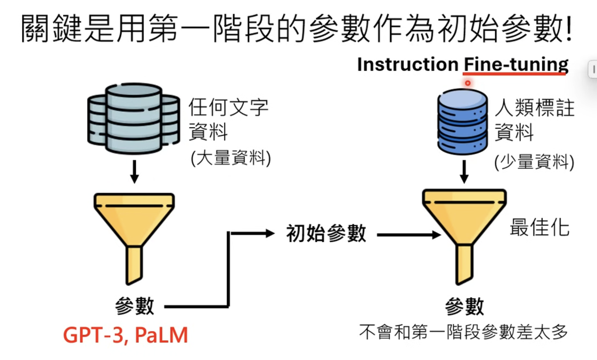
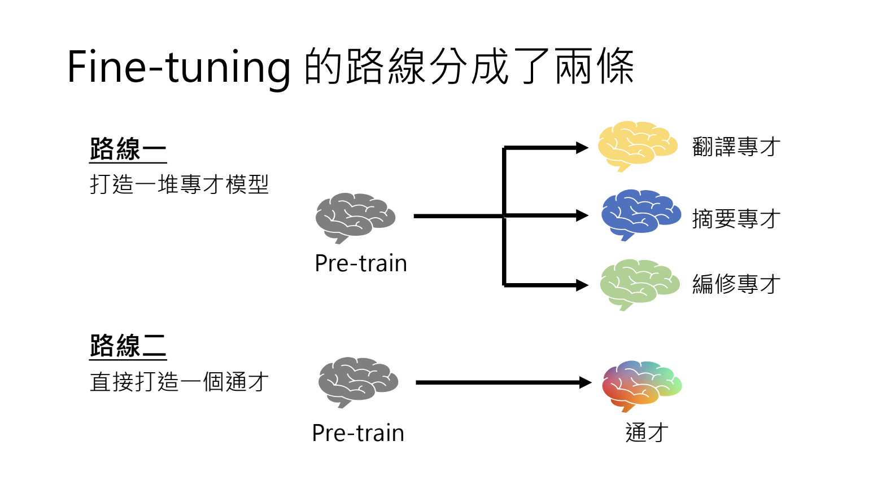
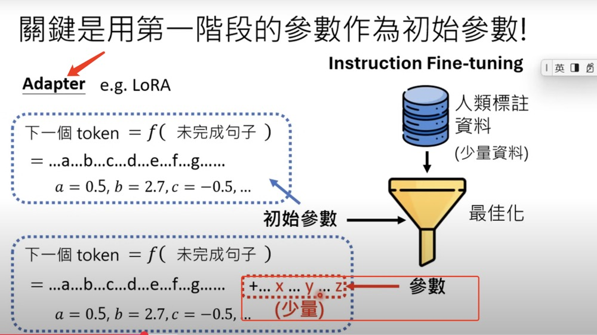

# Train LLM Part II

Course Materials

- recording: [第二階段: 名師指點，發揮潛力 (兼談對 ChatGPT 做逆向工程與 LLaMA 時代的開始](https://www.youtube.com/watch?v=Q9cNkUPXUB8)
- slides: [第二階段: 名師指點，發揮潛力 (兼談對 ChatGPT 做逆向工程與 LLaMA 時代的開始](https://drive.google.com/file/d/1SOXBQhsC_L6aHXcLx2rltaDdcO6N2FmJ/view)

## Notes

- 
- Adapter
  - save effort
  - keep the optimized parameters closer to the initial params
- The "one-against-many" capability can be quite powerful.
- Instruction Tuning roadmap: **specialist** vs **generalist**
   
- Build generalist
  - small models benefit more from human guidance
  - after instruction fine tuning, models get stable

## Terms

- Instruction Fine Tuning: Human master provides some instructions
- Supervised Learning
- pre train: self-supervised learning from raw materials
- instruction fine tune: learn from human master
- Adapter:
   

## Questions

- [ ] 1
- [ ] 1
- [ ] 1

## References

- [How LLM recap from what it has learned](https://arxiv.org/abs/1909.03329v2)
- [By OpenAI:Training language models to follow instructions with human feedback](https://arxiv.org/abs/2203.02155)