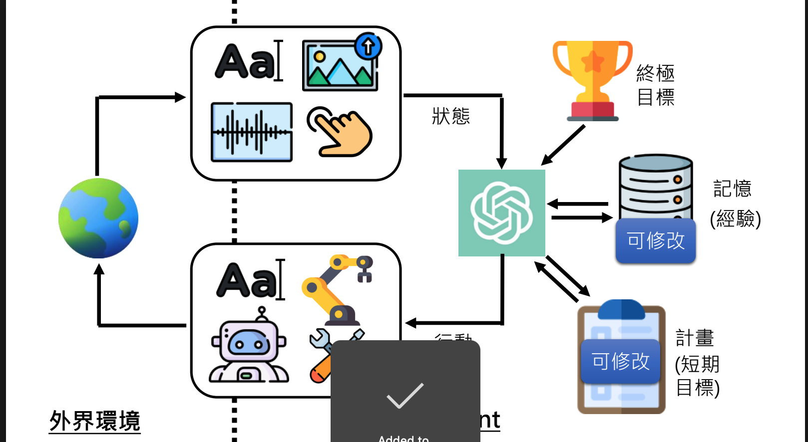
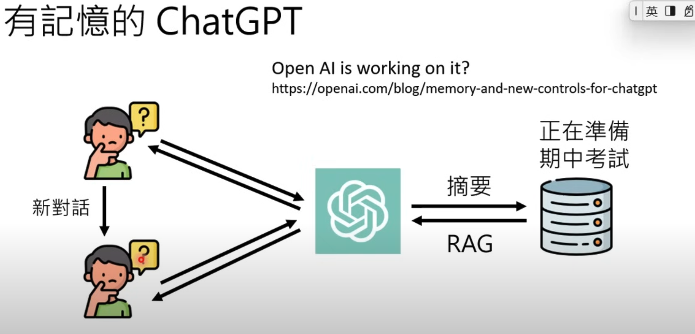
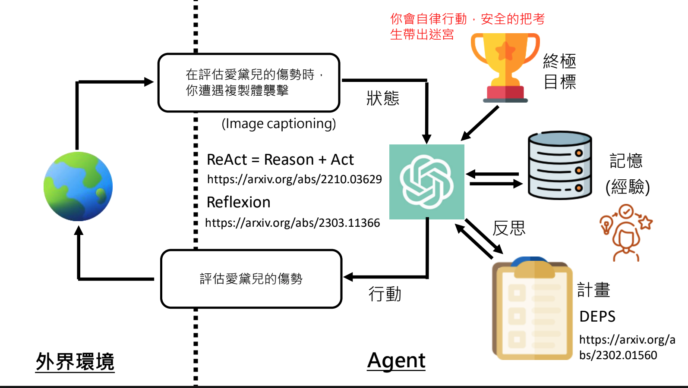

# 09. Make AI Agents using LLM

Course Materials

- recording: [第9講：以大型語言模型打造的AI Agent (14:50 教你怎麼打造芙莉蓮一級魔法使考試中出現的泥人哥列姆)](https://www.youtube.com/watch?v=bJZTJ7MjYqg&list=PLJV_el3uVTsPz6CTopeRp2L2t4aL_KgiI&index=12)
- slides: [第9講：以大型語言模型打造的AI Agent (14:50 教你怎麼打造芙莉蓮一級魔法使考試中出現的泥人哥列姆)](https://drive.google.com/file/d/1aW1cRdsxDzHuLdJCDwVHQ5KVlX2Tf7mN/view)

AI interacts with environments and deliver results to you.

- control agent using llm
- control Robot using llm
- [How AI agents potentially work](https://youtu.be/bJZTJ7MjYqg?si=2wGZVL7vHJgQF6k-&t=560). You can observe how cursor works to experience the process
  
- [How to persist memory in AI agent](https://youtu.be/bJZTJ7MjYqg?si=Q_d5pSZxeJ0gLPsn&t=861)

   

  - [stateful agent solution](https://github.com/letta-ai/letta)
  - paper: [`MemGPT`:Towards LLMs as Operating Systems](https://arxiv.org/abs/2310.08560)
- Design Graham

   

  - Challenges: how to convert text actions into agent's actual actions in either real or virtual world. T[he lecture mentioned an architecture from a paper](https://youtu.be/bJZTJ7MjYqg?si=F55W5qJ4iVF4DPH4&t=1213) to this challenge.
