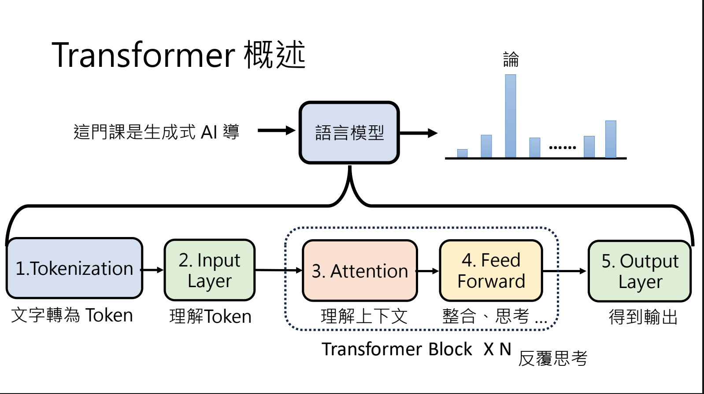
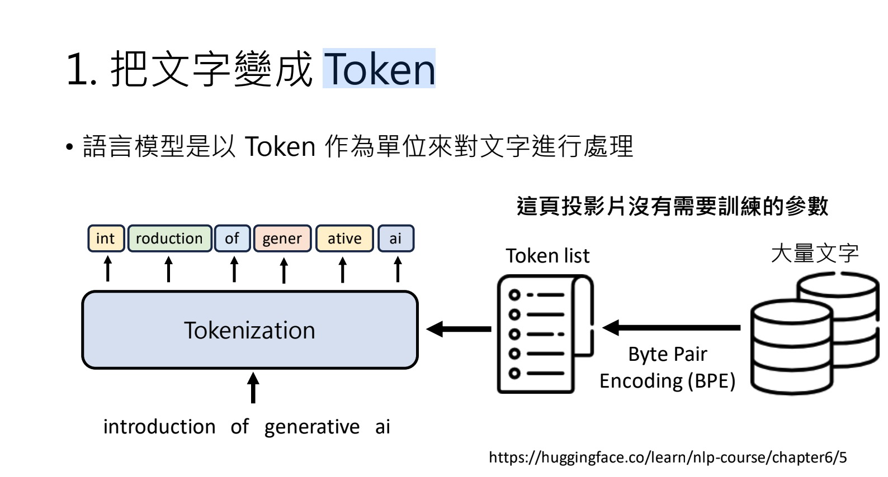
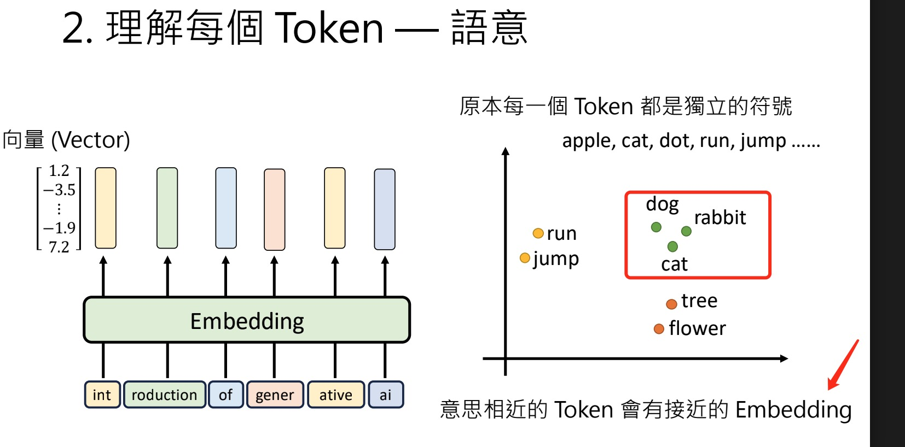

# 10. Brief intro to Transformer

- Why?: The Transformer content helps you understand how LLMs think!
- Lecture Materials

  - [Lecture Video](https://www.youtube.com/watch?v=uhNsUCb2fJI&list=PLJV_el3uVTsPz6CTopeRp2L2t4aL_KgiI&index=12)
  - [Lecture Slides](https://drive.google.com/file/d/1KeNAu6SAVliWzDPx__OZ23oMioLeHokD/view)

## Notes

- 

  - Tokenization module
   
    - The vocabulary (token list) is defined by the tokenizer/model creators. Different models may use different vocabularies.
    - A token is typically a subword or byte unit selected by the tokenizer (not necessarily a whole word).
    - BPE (Byte Pair Encoding) is a common tokenizer (others include WordPiece and Unigram).
  - Input Layer: Understand token semantics
    - **Token Embeddings**: Convert tokens to dense vector representations
      
      - Each token gets mapped to a learned vector in high-dimensional space
      - Similar tokens have similar vector representations (semantic similarity)
      - Machine learns these embeddings from training data through back-propagation
    - **Positional Encodings**: Add position information to preserve sequence order
      - Transformers process all tokens simultaneously (no inherent order)
      - Positional encodings inject position information into the embedding
      - Example: The word "bank" can mean different things based on context:
        - "I went to the bank" (financial institution)
        - "I sat by the river bank" (shore)
        - Same token, different positions → different contextual meanings
      - Positional encodings help the model distinguish between these contexts
  - Transformer Block: context
    - How attention module works
    - Terms:
      - Attention: the module in Transformer that considers the context
      - Contextualized token embedding: the token representation that incorporates context
      - Self-attention: allows each token to attend to all other tokens in the sequence. The relevance scores are attention weights; the matrix of these weights is the attention matrix.
      - Multi-head attention: multiple attention mechanisms running in parallel. Different heads capture different perspectives on relevance (e.g., dog–cat vs dog–bark), which a single head may not model accurately. Each head has its own attention weights and output; the head outputs are concatenated and projected into a single representation per token.

    - learnings: This explanation helped me understand why providing context is so important when communicating with LLMs.

## Go Further

If you want to get a further understanding about transformer, please visit

[【機器學習2021】Transformer (上)](https://youtu.be/n9TIOhRjYoc?si=yaadpbm8w1UgbkKU)
[機器學習2021】Transformer (下)](https://youtu.be/N6aRv06iv2g?si=FuemBCZt8ChwHOvu)
