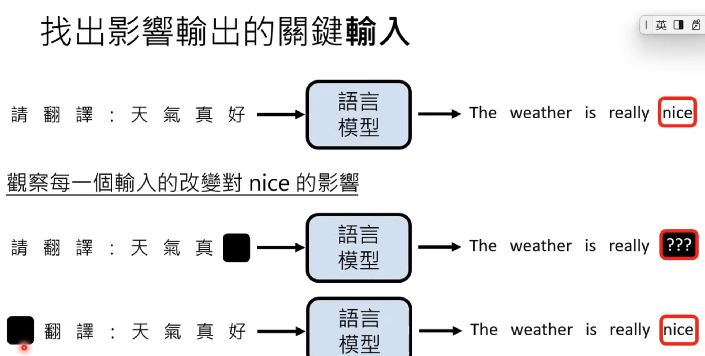

# Lecture 11: What Do LLMs Think? — A Brief Intro to Interpretability

- Interpretable: The model’s internal mechanisms are transparent. In LLMs, this means we can map behaviors to specific components (features/neurons/attention heads and their circuits) and make falsifiable predictions about outputs under interventions.
- Explainable: The model can provide human-readable reasons for its outputs without requiring full transparency. In LLMs, this is typically post-hoc rationalization or attribution (e.g., chain-of-thought, saliency, counterfactuals, influence functions) that should aim to be faithful rather than merely plausible.
- Artificial Intelligence can be explainable without being Interpretable.
- How to find the influence input factor
  - 
  - Analyze Attention
    - In context learning
      - 
      - [] question: Is it because model learns the meaning of the `positive` and `negative` -> then goes into do the task?
    - [Identify the key training materials that influences the output](https://youtu.be/rZzfqkfZhY8?si=Rw2bPr9IC0NXV_e5&t=1157)
    - Larger models possess cross‑lingual and abstract learning capabilities, while small models don\'t.
    - [probing LLMs](https://youtu.be/rZzfqkfZhY8?si=qaxfiaDh3GpO5OUB&t=1477)
    - Bert: sentence -> [surface -> syntactic -> Semantic] (句子 -> [表层 -> 句法 -> 语义])
    - Project embedding (complex vector) to a two demential vector.
    - build lie detector from LLM embedding.