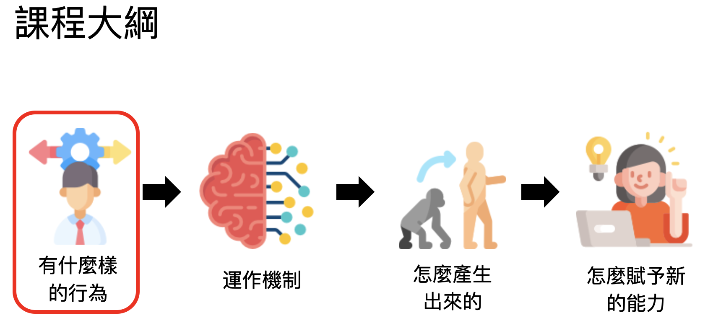
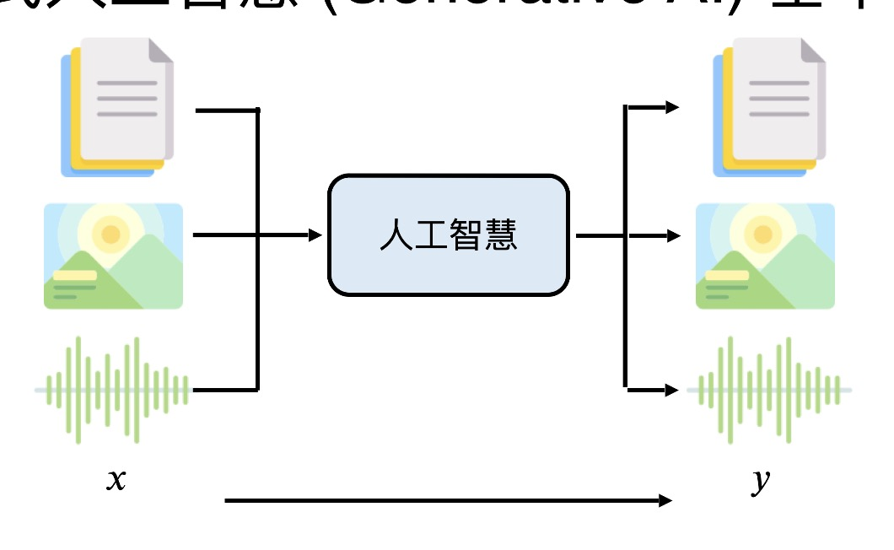
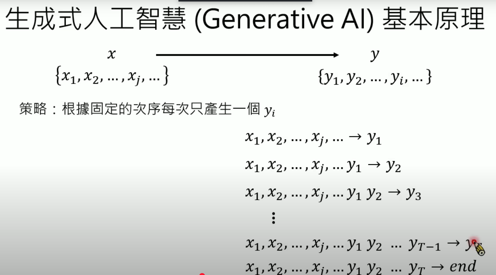
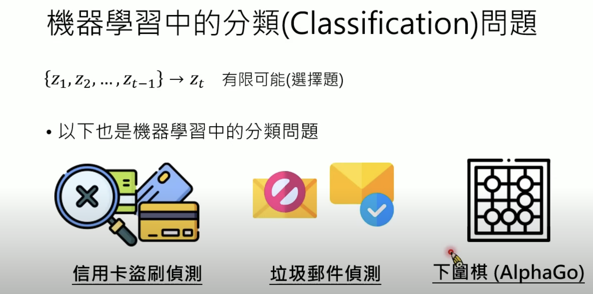
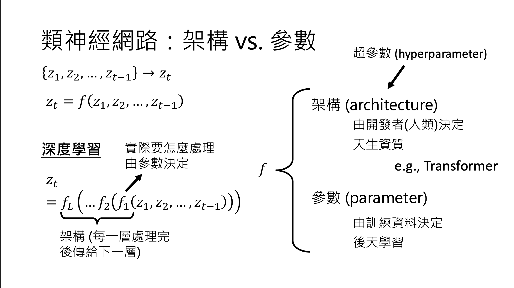

# 01. Course Orientation

## Materials

- recording: [https://www.youtube.com/watch?v=QLiKmca4kzI&t=1997s](https://www.youtube.com/watch?v=QLiKmca4kzI&t=1997s)
- [course lecture](https://drive.google.com/file/d/1ZEVgcwNBCqaPQlrAbjJb8S6BQJkEZYdp/view)

## What can AI do (behavior)

- Machine shows some reasoning capability
- AI Agent
  - definition: please see  [lecture 2](https://www.youtube.com/watch?v=M2Yg1kwPpts)
    - learn from experience
    - can do planning and own some judgement
    - can use tool and take actions
  - Deep research: Possess some AI agent capabilities.
    - an iterative process, more questions and work are added with new information discovered from searching
  - [operators.chatgpt.com](https://operator.chatgpt.com/)

## How Generative AI works inside

- Complex objects are composed of finite basic units: `y = {y₁, y₂, ..., yᵢ, ...}`
- Generative AI is about generating a group of tokens from the input tokens.

  - Each step performs the same task: `x' → yi`. [Given a series of tokens → Determine the next token (multiple choice selection) The model takes a sequence of existing tokens as input and predicts the most likely next token from all possible tokens in its vocabulary.](https://youtu.be/QLiKmca4kzI?si=JHNkTA0chIzRu5q8&t=2210). The same token generation rationale applies to video and audio generation. We call the token generation process autoregressive generation.
  - until the token generation process ends. The token generation ending logic depends on your application.
- deep learning: how reasoning works
  - using multiple layers to break bigger complex task into smaller simpler task
  - using internal simulation on each layer -> testing time scaling ( how GPT o1 works). How it worked? Replace end signal wait.

## How it is created

- classification: for a given input, classify its type

- translation:  (multiple types) input language -> output language => generalist in translation. After training, the model may have formed its internal knowledge

- 

### Generalist models evolution

- LLMs Evolution: needs plugins as its output is encode not natural language (Bert generation) -> needs brain surgery (GPT 3 era) -> instruction works as expected (2023~)
- Voice Models follows the same progression pattern

multi-modals?

## How to add new capability to AI

- foundation model
  - -> instructions
  - -> fine tuning & how to avoid damage model capability after fine tuning.
  - -> model editing
