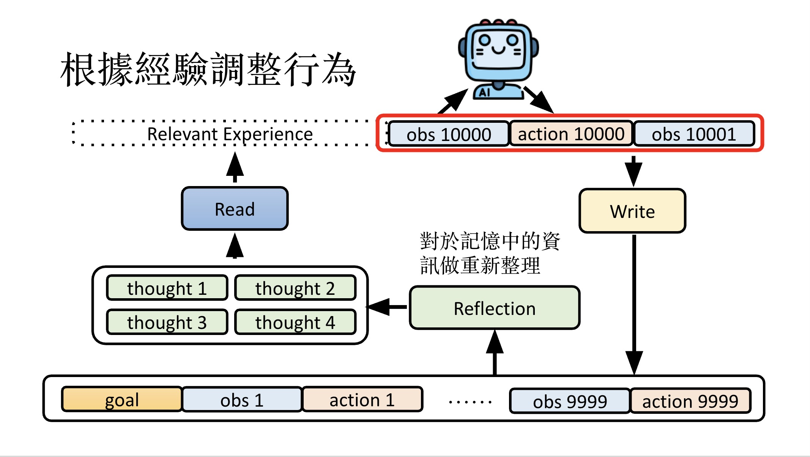
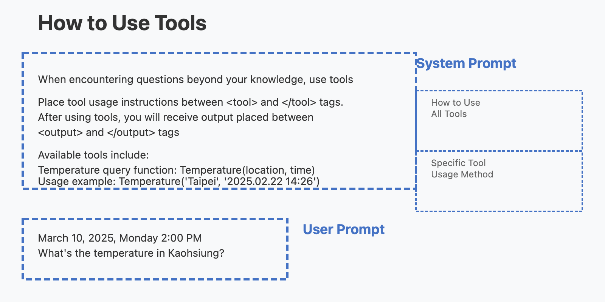
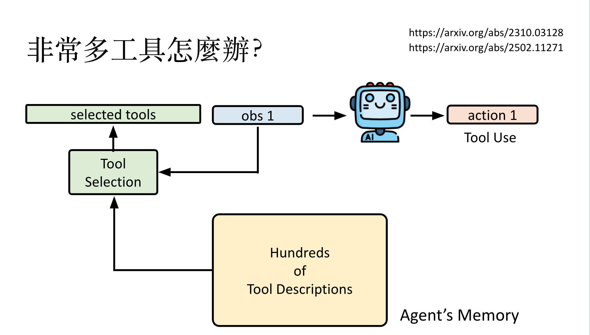
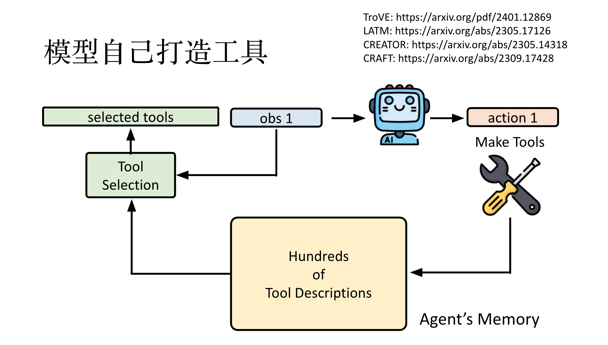
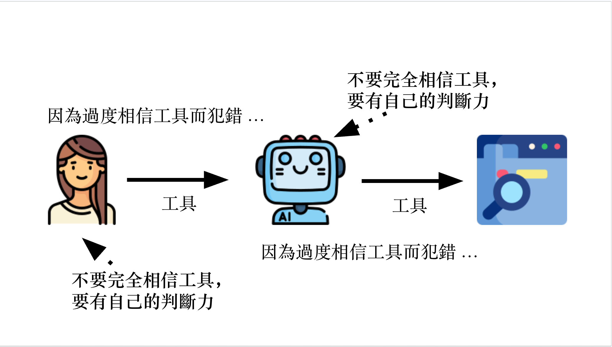
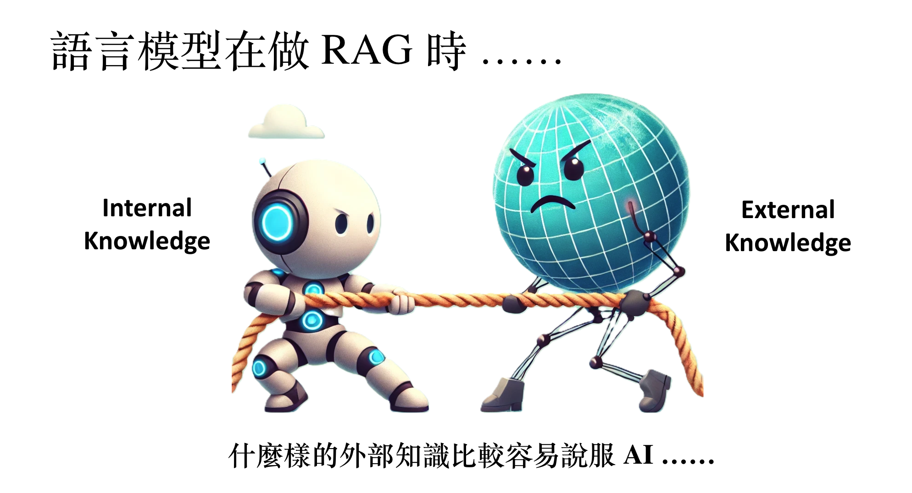

# 02. AI Agent

About: Understanding AI Agent Principles in One Lesson - How AI Adjusts Behavior Through Experience, Uses Tools, and Makes Plans.

- Materials:
  - recordings: [一堂課搞懂 AI Agent 的原理](https://www.youtube.com/watch?v=M2Yg1kwPpts)
  - [Slides](https://docs.google.com/presentation/d/1kTxukwlmx2Sc9H7aGPTiNiPdk4zN_NoH/edit?slide=id.p1#slide=id.p1)

## Notes

- Three core capabilities of AI Agents:
  - adjust behavior based on experience
  - use tools
  - planning

### adjust behavior based on experience

   

- three sub modules: all these can be built on top of LLM
  - read
  - write
  - reflection
- We can also convert the learned thoughts into knowledge graph
- model may remember wrong like a human
- [to learn more about agent memories, please visit this slides](https://docs.google.com/presentation/d/1kTxukwlmx2Sc9H7aGPTiNiPdk4zN_NoH/edit?slide=id.p46#slide=id.p46)

## Use Tools

A Tool: You Know How to Use It But Don't Necessarily Need to Know How It Works Under the Hood

- Commonly used tools by LLMs are
  - search engine,
  - python,
  - other AI

### How to use tool

OpenAI models use two main prompt types:

- **System prompts**: Set behavioral guidelines and context
- **User prompts**: Contain user requests and instructions

**Priority behavior:**

- System prompts generally have higher priority for safety-critical instructions
- User prompts can sometimes override system prompts for task-specific requests
- The interaction is complex and depends on model training, not a simple hierarchy
- Safety-related system instructions typically maintain priority regardless of user input

### Challenges of using Tool

- numerous tools:
  - Q: what if there are numerous tools
  - S: build tool retrieval system using the idea of using memory
  
- Agent makes its own tool.
  

- LLMs can exercise some degree of judgment when using tools.

 

- How AI Makes Judgments
  - Trust and Reliability Patterns
    - Language models tend to trust relatively novel text more than familiar content
    - Data sources have minimal impact on model judgment
  - Prior Knowledge vs. New Information
    - LLMs increasingly revert to their prior knowledge when original context is progressively modified with unrealistic values
    - Models show stronger adherence to their training data when presented with implausible or contradictory information
  - Confidence and Context Relationship
    - The likelihood of an LLM adhering to retrieved information presented in context is inversely correlated with the model's confidence in its response without that context
    - When models are less confident about their internal knowledge, they're more likely to accept external information
    - When models have high confidence in their prior knowledge, they tend to reject contradictory external context
  - Behavioral Tendency
    - AI systems tend to trust similar AI-generated content (suggesting potential echo chamber effects in AI-to-AI information transfer)

- Can LLM Make Plan
  - LLM can make plan doesn't mean it know what is doing. It might because it learned the planning content from internet
  - empower AI making plans
    - [trial and interact with  env](https://youtu.be/M2Yg1kwPpts?si=-5g3EMEx-gOL3z9f&t=5534). 
      - This solution doesn't work well when trial paths are massive. One way to reduce paths is ditching sub paths early with failure path
      - Simulation in a virtual environment: Implemented actions might not be reversible -> Mock actions implementation -> Model may not know how environment's feedback -> need a world model

- Simulation in virtual world might be how reasoning works internally in LLMs
  - The danger of overthinking: examining the reasoning action dilemma in Agentic tasks

## Insights

- Influence AI -> Influence Others

- SMT solver
- Is your LLM secretly a world model of the internet?
- Google co-scientist
