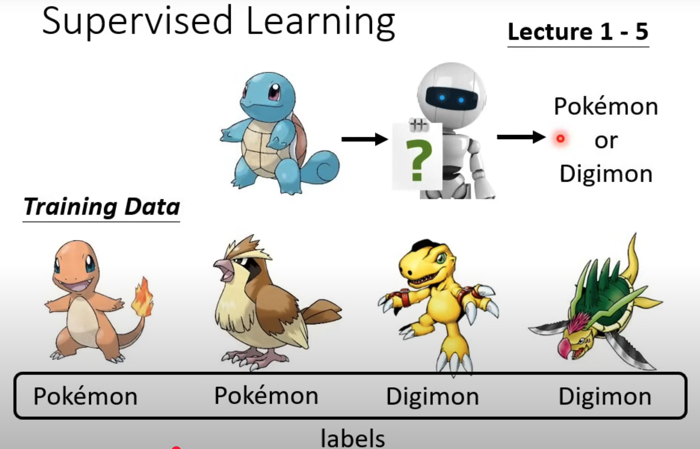
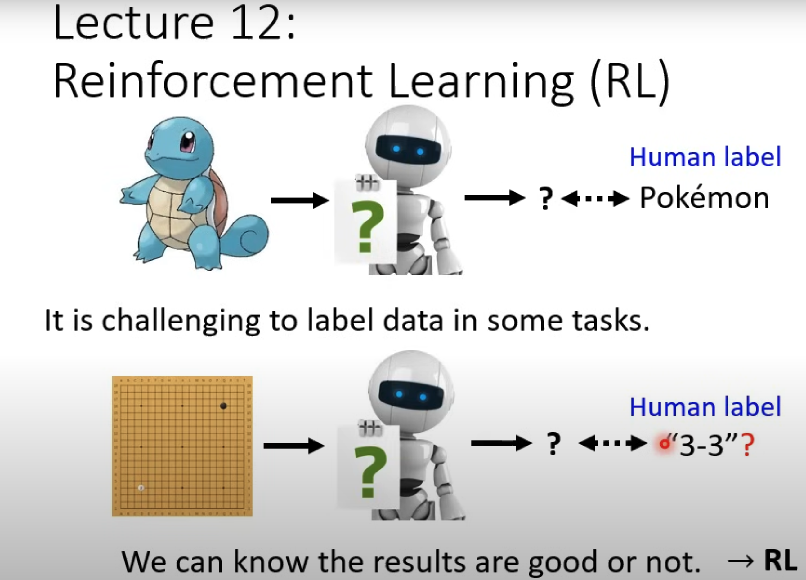
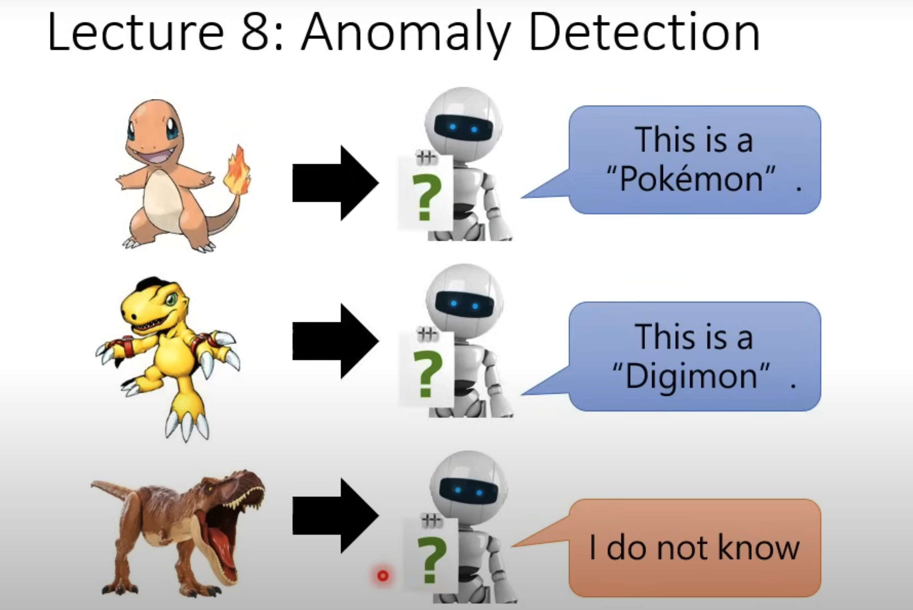
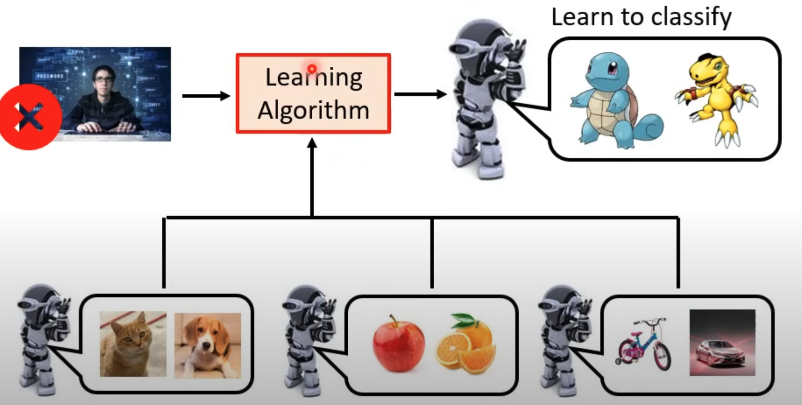

# Introduction to ML and course Orientation

- Machine Learning ≈ Looking for Function - using computers to find complex functions that humans can't easily discover manually.
- Major Concepts: [regression, classification, and transform](https://youtu.be/7XZR0-4uS5s?si=FAN8eXAmzSM1KmRk&t=409)
- How Machine finds these functions
  - 
  - Self  Supervised Learning: We expect and train model to have some general purpose capabilities.  After machine has learned these general knowledges, its form the capability to solve problem of a specific tasks(downstream tasks).
  - Reinforcement Learning: you don't know how but you know what is good and bad.
    - 
- Anomaly Detection: Learning when to say NO
  - 
- Explainable AI: Being able to give a result doesn't necessarily mean the machine is smart. See why it is import [here](https://youtu.be/7XZR0-4uS5s?si=j6XRIVoO-V_mTIJK&t=1380)
- Molde Attack
- Domain Adaptation
- Network Compression: run models on edge
- Meta Learning: Learn to Learn. Machine creates new algorithms from its experience.
  - 
  - Few-shot learning: Learn something with minimum examples.
  