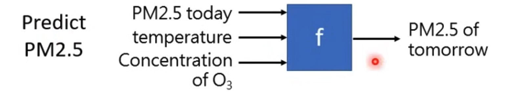
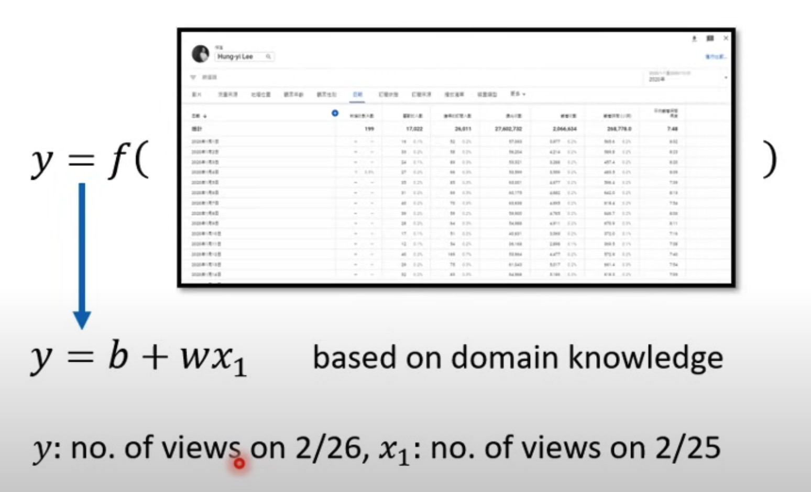
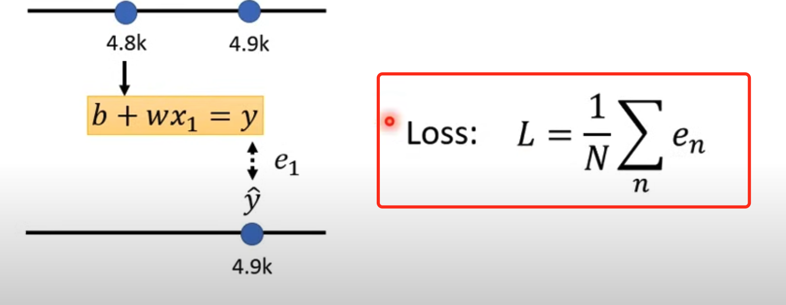

# Brief The ML Fundamental Principles

## Materials

- Preparation Courses
  - [Introduction to basic concepts of machine learning, Part I](https://www.youtube.com/watch?v=Ye018rCVvOo). The tutorial slide is [here](https://speech.ee.ntu.edu.tw/~hylee/ml/ml2021-course-data/regression%20(v16).pdf)
  - [Introduction to basic concepts of machine learning, Part II](https://www.youtube.com/watch?v=bHcJCp2Fyxs)
- [Current Tutorial: Brief ML Principles via Revisiting Pokémon and Digimon Classifier](https://www.youtube.com/watch?v=_j9MVVcvyZI&list=PLJV_el3uVTsPM2mM-OQzJXziCGJa8nJL8&index=2)
  
## Preparation Course Notes

### Different Types of Functions

- Regression: the function outputs a scalar
  
  

- Classification: Given options (classes), the function outputs the correct one
  
  

- Structured Learning: Create something with structure (image, document) - learn to innovate

### How Machine finds the function

- Step 1: write down a function with unknown parameters, in the youtube transaction example, the function is `y = b + wx1`, ,
  - usually, the function design is based on domain knowledge, see screenshot below,

 

- In the above function, the  `b` and the `w` are the parameters we want to figure out through the help of Machine
- Some jargons in the ML
  - **Model**, the function with the unknown parameters
  - `b` is `bias`
  - `w` is `weight`

- Step 2: Define the Loss from Training Data
  - what is loss: loss is a function of parameters `L(b, w)`
  - The output value of the `loss` function represents how good a set of values is
  - `Label`:the actual correct value
  - [Explain the loss function using youtube transaction prediction example](https://youtu.be/Ye018rCVvOo?si=1qq_EHk6Eh1z_5ll&t=1199), see screenshot below
  
  

  - **Hyper parameters**: settings or configurations that are not learned from the data, but set before the training process (e.g., learning rate, number of iterations)
  - When to stop the model iteration training:
    - you lost patience
    - the loss function gets value as `0`
      - local minimum
      - global minimum

- Step 3: Optimization
