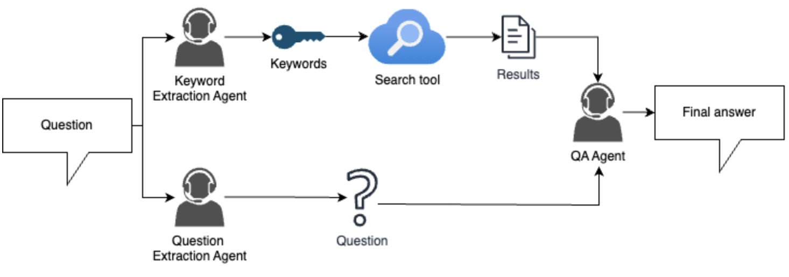

# README

- Materials
  - [slides](https://speech.ee.ntu.edu.tw/~hylee/ml/ml2025-course-data//hw1.pdf)
  - [TA guide](https://www.youtube.com/watch?v=0ylc6rnoTOM)

The homework solution uses [OpenAI `Agentic` AI python SDK](https://openai.github.io/openai-agents-python/).
The workflow is as below:



## Learnings

- Each agent in the pipeline may deviate slightly from the optimal path, and these small 
deviations can accumulate throughout the multi-agent workflow, resulting in discrepancies 
in the final answer compared to the ground truth.
- LLM itself can craft very good prompt

## OpenAI `Agentic` AI Python SDK

- How `result` looks like

```json
{
  "input": "I'm Walt White. I come here to visit Kate",
  "new_items": [
    {
      "agent": {
        "name": "welcome agent",
        "handoff_description": null,
        "tools": [],
        "mcp_servers": [],
        "mcp_config": {},
        "instructions": "you welcome guest using a warm and polite measure",
        "prompt": null,
        "handoffs": [],
        "model": null,
        "model_settings": {
          "temperature": null,
          "top_p": null,
          "frequency_penalty": null,
          "presence_penalty": null,
          "tool_choice": null,
          "parallel_tool_calls": null,
          "truncation": null,
          "max_tokens": null,
          "reasoning": null,
          "metadata": null,
          "store": null,
          "include_usage": null,
          "response_include": null,
          "top_logprobs": null,
          "extra_query": null,
          "extra_body": null,
          "extra_headers": null,
          "extra_args": null
        },
        "input_guardrails": [],
        "output_guardrails": [],
        "output_type": null,
        "hooks": null,
        "tool_use_behavior": "run_llm_again",
        "reset_tool_choice": true
      },
      "raw_item": {
        "id": "msg_689cc9a2322481a0843fa336eba7488203dd75e666a67068",
        "content": [
          {
            "annotations": [],
            "text": "Welcome, Mr. White! It's a pleasure to have you here. Kate will be delighted to see you. Can I offer you anything while you wait?",
            "type": "output_text",
            "logprobs": []
          }
        ],
        "role": "assistant",
        "status": "completed",
        "type": "message"
      },
      "type": "message_output_item"
    }
  ],
  "raw_responses": [
    {
      "output": [
        {
          "id": "msg_689cc9a2322481a0843fa336eba7488203dd75e666a67068",
          "content": [
            {
              "annotations": [],
              "text": "Welcome, Mr. White! It's a pleasure to have you here. Kate will be delighted to see you. Can I offer you anything while you wait?",
              "type": "output_text",
              "logprobs": []
            }
          ],
          "role": "assistant",
          "status": "completed",
          "type": "message"
        }
      ],
      "usage": {
        "requests": 1,
        "input_tokens": 30,
        "input_tokens_details": {
          "cached_tokens": 0
        },
        "output_tokens": 32,
        "output_tokens_details": {
          "reasoning_tokens": 0
        },
        "total_tokens": 62
      },
      "response_id": "resp_689cc9a1716881a0bdfcd89f3d6ab24003dd75e666a67068"
    }
  ],
  "final_output": "Welcome, Mr. White! It's a pleasure to have you here. Kate will be delighted to see you. Can I offer you anything while you wait?",
  "input_guardrail_results": [],
  "output_guardrail_results": [],
  "context_wrapper": {
    "context": null,
    "usage": {
      "requests": 1,
      "input_tokens": 30,
      "input_tokens_details": {
        "cached_tokens": 0
      },
      "output_tokens": 32,
      "output_tokens_details": {
        "reasoning_tokens": 0
      },
      "total_tokens": 62
    }
  },
  "_last_agent": {
    "name": "welcome agent",
    "handoff_description": null,
    "tools": [],
    "mcp_servers": [],
    "mcp_config": {},
    "instructions": "you welcome guest using a warm and polite measure",
    "prompt": null,
    "handoffs": [],
    "model": null,
    "model_settings": {
      "temperature": null,
      "top_p": null,
      "frequency_penalty": null,
      "presence_penalty": null,
      "tool_choice": null,
      "parallel_tool_calls": null,
      "truncation": null,
      "max_tokens": null,
      "reasoning": null,
      "metadata": null,
      "store": null,
      "include_usage": null,
      "response_include": null,
      "top_logprobs": null,
      "extra_query": null,
      "extra_body": null,
      "extra_headers": null,
      "extra_args": null
    },
    "input_guardrails": [],
    "output_guardrails": [],
    "output_type": null,
    "hooks": null,
    "tool_use_behavior": "run_llm_again",
    "reset_tool_choice": true
  }
}

```