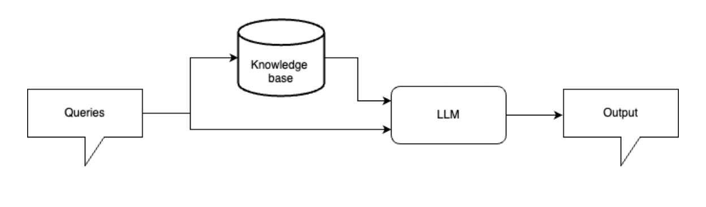
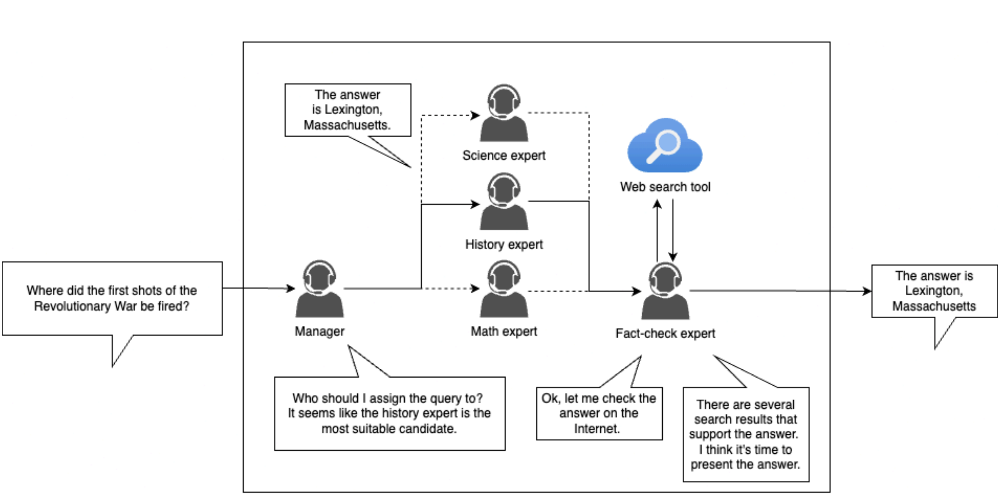
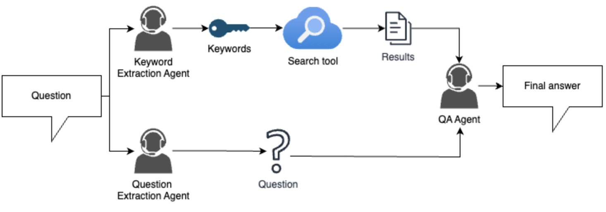

# Concepts and Learnings from HW1

## RAG

- What is RAG: Retrieval augmented generation (RAG) is a method that allows LLMs to answer the query with external knowledge.
  - In a naive RAG approach, the query will be fed to a knowledge base to gather relevant information first.
  - 
- Why RAG:
  - Knowledge cutoff: An LLM must be trained on data that "exist" at the time it was trained. For example, an LLM trained in 2024 will not know about anything in 2025. RAG can let the LLM have the access to the latest information.
  - reducing training cost: When dealing with private data that an LLM unlikely have seen, one can choose to fine-tune the LLM. However, it is costly to fine-tune an LLM. RAG is another approach to allow LLMs to access the private data without the need of training.
  - Improving the reliabilities of generated answers
By the nature of LLMs, it is a common issue that LLMs will produce hallucinations.
With RAG, one can examine the source of the generated texts, hence improve the
reliabilities of the answers.

## Agentic System

An agentic system is a framework where LLMs act as individuals and cooperate to
complete complex tasks.

## Optimize Search Result

