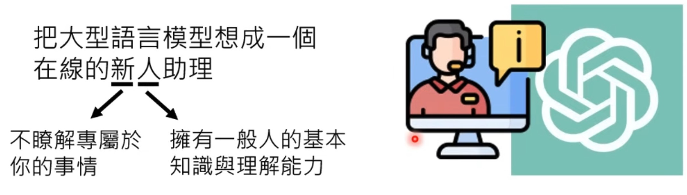
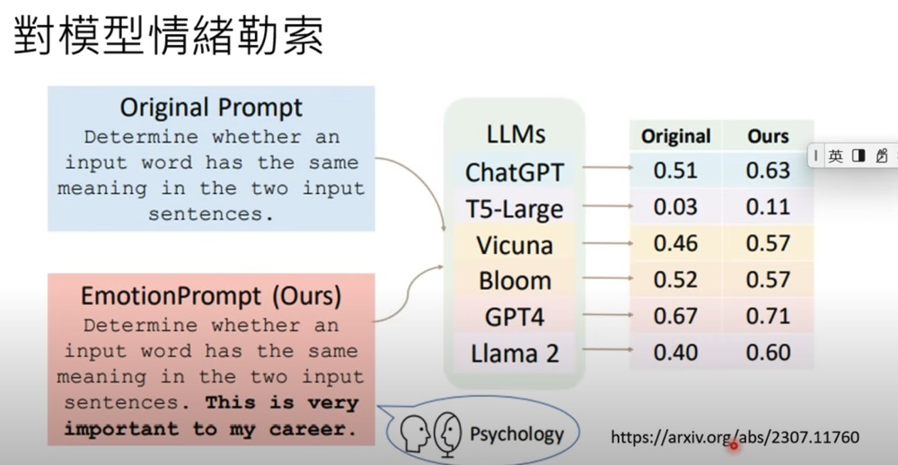
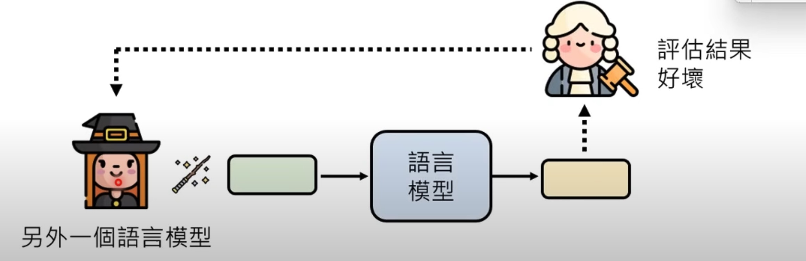
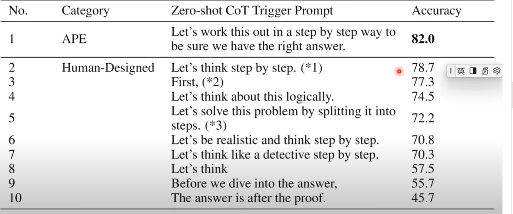
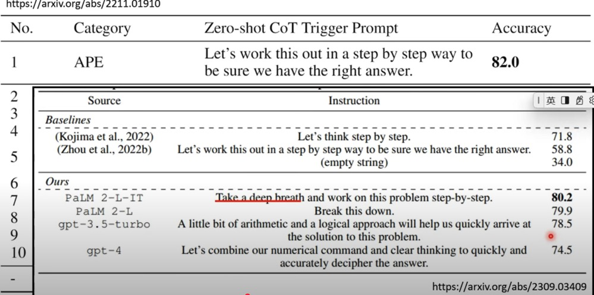

# Train Yourself to be a Better Commander

Treat it like a human being and be a good commander - providing a clear & concrete goal, command, and context.

My(Kate's) Understanding

- Provide computational thinking-related keywords to LLM
- Be a good commander
- Employ Influence:
  - Emotional blackmail
  - reward & penalty
  - be a good coach & commander

## Spell to LLMs

Spell may work or not work for different models.

- > Let's think step by step (chain of thought)
  - This spell also works for GPT-4 on reading image content
- Asking the model to explain its result also helps. For example, "Answer by starting with analysis"
- Emotional Blackmail. For example, "This is very important to [xx]"

  

- You can find more spells in [Principled instructions are all you need for questioning](https://arxiv.org/pdf/2312.16171). Some useful findings in this article are below:

- > being polite doesn't make LLMs more effective
- > Employ affirmative directives such as 'do, while steering clear of
  negative language like 'don't'.
- > Add "I'm going to tip $xxx for a better solution"
- > Incorporate the following phrases: `You will be penalized`
- > `Ensure that your answer is  unbiased and avoids relying on stereotypes`

Kate's version:

> Do not take actions until you have >= 95% confidence in what I'm talking about. Before reaching that confidence level, you ask clarification questions.

## How to find these Mantras

Defeat magic with magic

- Employ RL to find spells

- What spell(s) can I use to strength your capability, for (a) given task(s)

## In  Context Learning

[You can provide a few examples in the context, such that models can learn from the provided examples.](https://youtu.be/A3Yx35KrSN0?si=48e38u3qLXK_OGhg&t=1388)

As model = f(parameters), and providing a few examples in the prompt doesn't change the parameters and function `f`. So the result doesn't persist between conversations.
