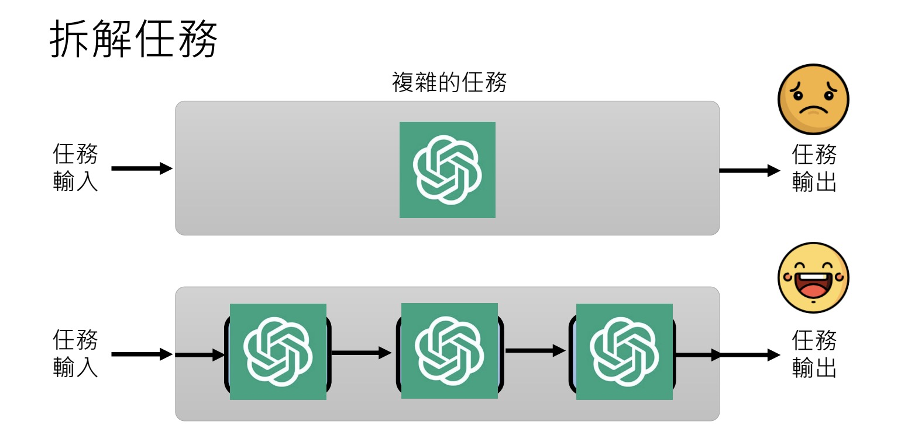

# Train Your Self

## Materials

- Recording: [Troubleshooting and using tools](https://www.youtube.com/watch?v=lwe3_x50_uw&list=PLJV_el3uVTsPz6CTopeRp2L2t4aL_KgiI&index=5)
- slides, see [here on google slides]([Letctur](http://drive.google.com/file/d/1eVC4dx77Mba2_yMFe1_w4tXvIdSDTOCO/view))

## Notes

- Break bigger task into smaller tasks
  - 
  - why `Chain of thought` works? It pushes models to break bigger task into smaller tasks
- Command LLMs to check errors in its own output
  - 
  - LLMs have the capability to recognize its own error (GPT 4)
  - But, > During the introspection process, no model is trained; the function is fixed.
Its capabilities will truly change.

- Why the same input may get different output from LLMs
  - the same input gets a probability (item) range.
  - then LLMs Roll the dice to select an item from the range to you
  - that means, even if the same input can bring you the same probability range, but the result is random
    