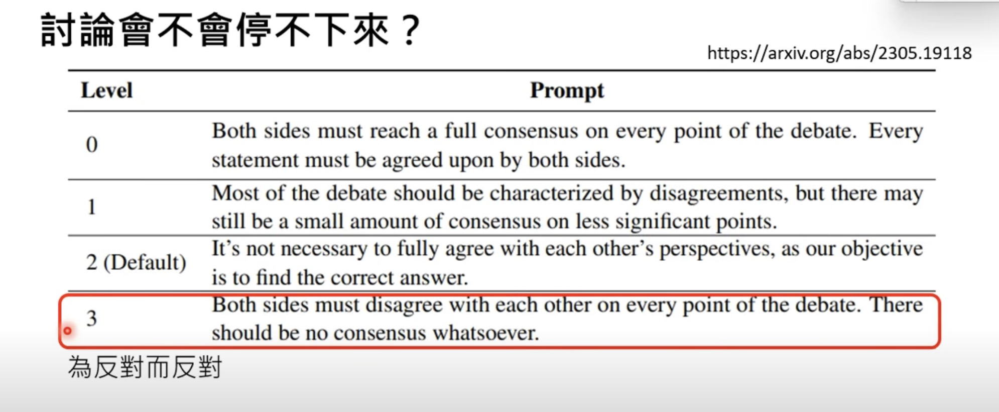
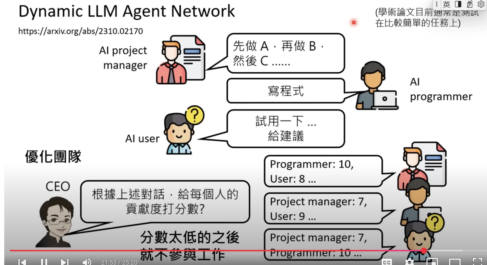
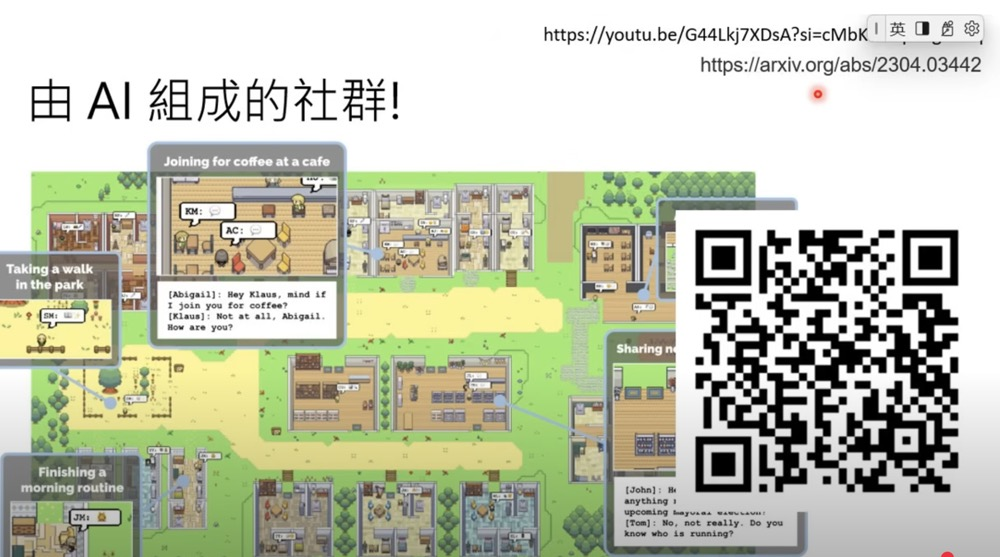

# Organize team using different LLMs

recordings:
[生成式AI導論 2024】第5講：訓練不了人工智慧？你可以訓練你自己 (下) — 讓語言彼此合作，把一個人活成一個團隊 (開頭有芙莉蓮雷，慎入)](https://www.youtube.com/watch?v=inebiWdQW-4&list=PLJV_el3uVTsPz6CTopeRp2L2t4aL_KgiI&index=6)

## Key Points

- Different Models may have different capability and cost for different tasks.
- 
- Require LLM to do reflection work may work with inherent flaws: see article [Encouraging Divergent Thinking in Large Language Models through Multi agent Debate](https://arxiv.org/abs/2305.19118), the DOT problem. However, our study shows that such reflection-style methods suffer from the Degeneration-of-Thought (DoT) problem: once the LLM has established confidence in its solutions, it is unable to generate novel thoughts later through reflection even if its initial stance is incorrect. To address the DoT problem, we propose a Multi-Agent Debate (MAD) framework, in which multiple agents express their arguments in the state of "tit for tat" and a judge manages the debate process to obtain a final solution.

    
- How to facilitate discussion between LLMs
 
- 
- 
- 

## Interesting findings

- [https://github.com/FoundationAgents/MetaGPT](https://github.com/FoundationAgents/MetaGPT)
- 
