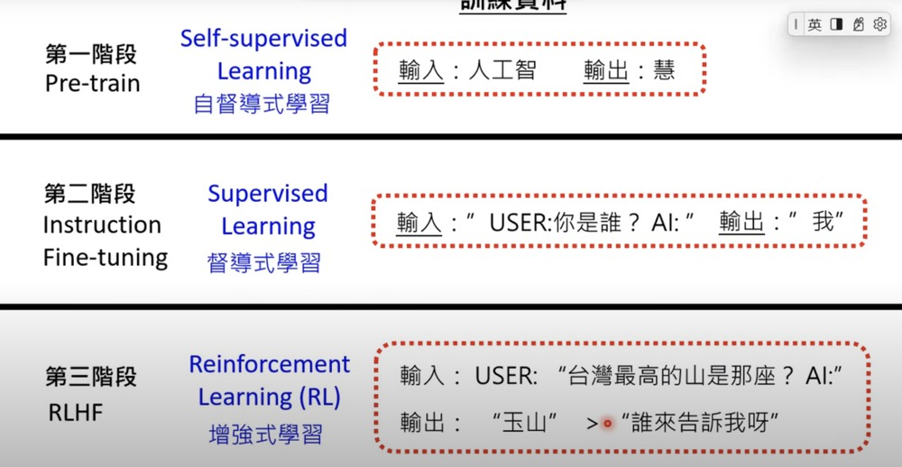
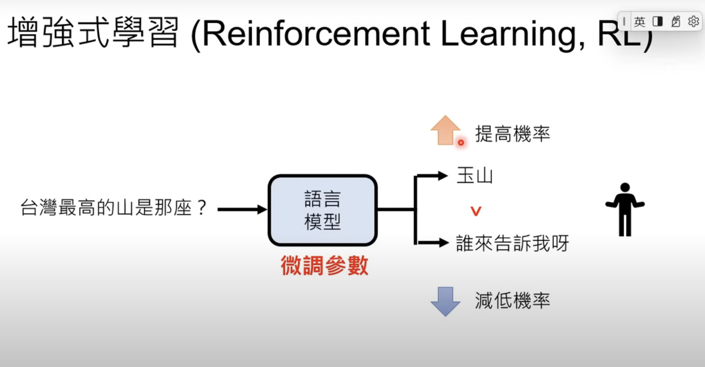
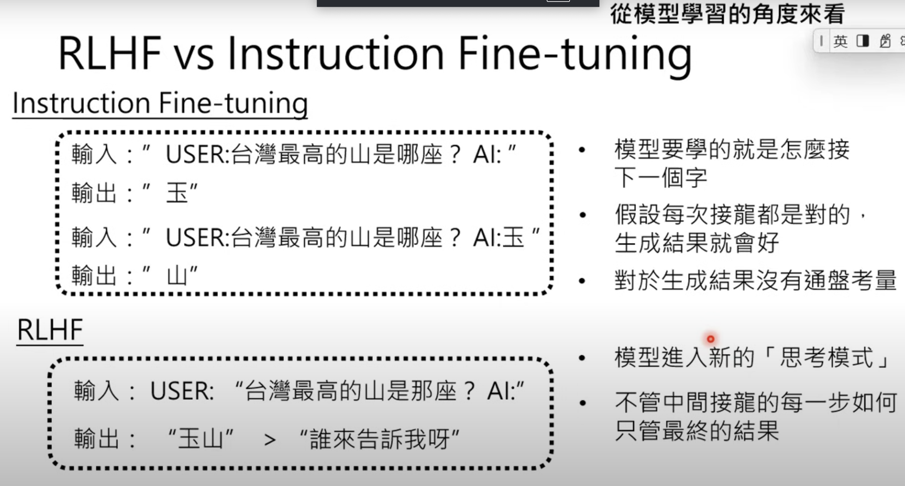

# Train LLM P1

Course Materials

- recording: [Reinforcement Learning from Human Feedback, RLHF](https://www.youtube.com/watch?v=v12IKvF6Cj8)
- slides: [Reinforcement Learning from Human Feedback, RLHF](https://drive.google.com/file/d/1CTSovIDsimYFiCLNYEQEMLuBNW8RYBVY/view)

## Notes

- Recap the difference on different learning stages

- Reinforcement Learning: Improve/reduce good/bad (from human perspective) response possibility based on human feedback.

- The influence on different training stages to LLM
  - Phase 1 & 2 focus on predicting the next word. The assumption underlying this approach is that if each individual token/segment is correctly predicted, then the final response will be correct. However, this assumption is not always valid. **Process over result**
  - Phase 3: Model learned that the final result is what matters. This helps LLM also consider things from a macro perspective. **Result over process**.

- Reinforcement Learning application in AlphaGo and LLMs training
  - Go has clear rules
  - You can't respond good or bad with a single response

## Terms

## Questions

## References
